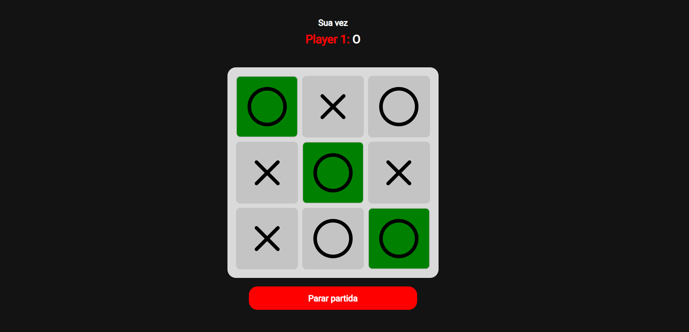

# Jogo da Velha 👵🏾

O Jogo da Velha. Você pode jogar com mais uma pessoa, porém no mesmo dispositivo.  
Escolha seu símbolo e descubra a melhor estratégia para combinar três campos e ganhar do seu adversário!

[🕹 Jogue aqui!](https://lucyanovidio.github.io/tic-tac-toe/)

## ⚙ Alguns recursos

* Jogo multiplayer
* Você escolhe seu símbolo, podendo alterar a escolha
* O jogo marca os campos de vitória
* O jogo te mostra o vencedor e o empate caso ocorra
* Um mesmo campo não pode ser selecionado duas vezes
* O jogador pode interroper o jogo no meio da partida
* Responsividade

## 🛠 Tecnologias

  
  
  

 

> Este jogo foi desenvolvido por diversão. Precisa de muita melhoria técnica, mas foi interessante de desenvolver e eu aprendi bastante! Fica a dica: Não se prenda a monotonia da rotina. Sempre que puder, se divirta com o que escolheu por profissão! 😁

---

<table>
  <tr>
    <td>
      
    </td>
    <td>
      Feito por <a href="https://github.com/lucyanovidio">Lucyan Ovídio.</a> 🙋🏿‍♂️
    </td>
  </tr>
</table>
